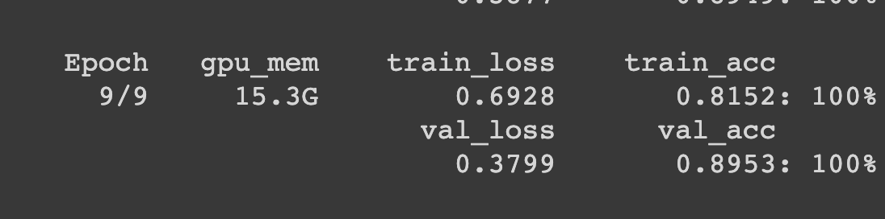
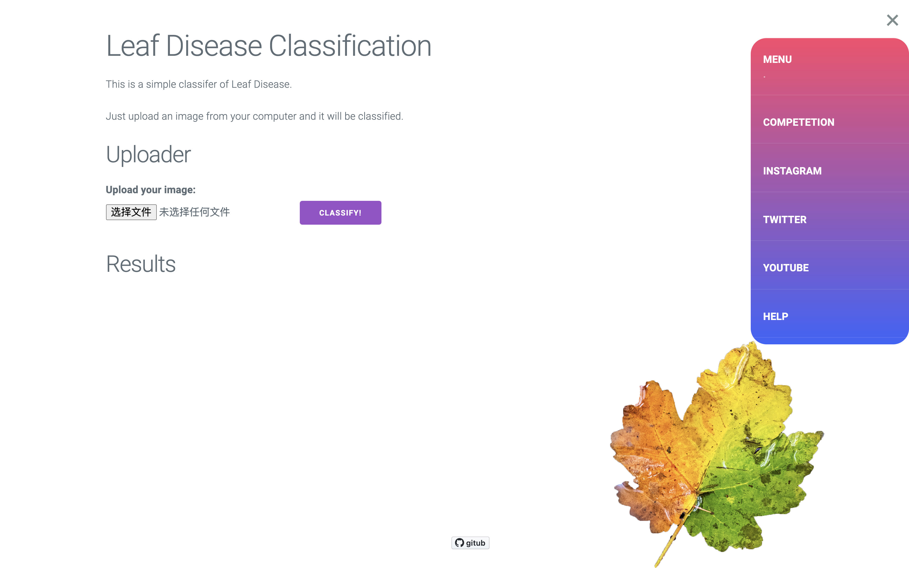

# Leaf Disease classifier


### 部署模型
模型使用的是谷歌的 **EfficientNet-B5 Noisy-Student** 
使用 **Cassava Leaf Disease Classification** 的数据集进行训练 ( 512 x 512 )



```bash
docker build -t leaf_disease_classifier . && docker run --rm -it -p 5000:5000 leaf_disease_classifier
```


### Reference
Dataset: [cassava-leaf-disease-classification](https://www.kaggle.com/c/cassava-leaf-disease-classification/data)
Github: [Sebastian-Schuchmann](https://github.com/Sebastian-Schuchmann/ChurrosSamosaClassifier)
Medium: [Anne Bonner](https://heartbeat.fritz.ai/brilliant-beginners-guide-to-model-deployment-133e158f6717)
Youtube: [Sebastian Schuchmann](https://youtu.be/k1GIEkzQ8qc)
Navigation Bar: [plavookac](https://codepen.io/plavookac/full/qomrMw)
